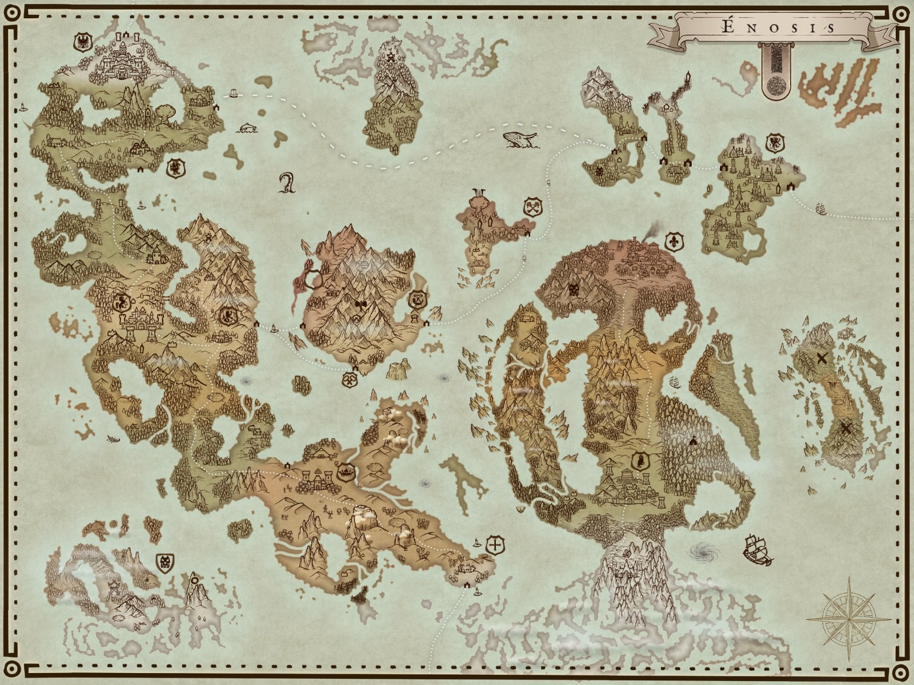
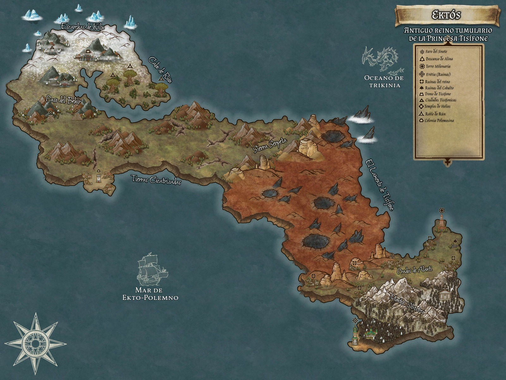

# Notas

Abatida -> Dia de descanso 1o

## Acto II
----

*Objetivo: Buscamos la ubicacion de los contenedores de las memorias*

## Notas si canonicas (oidas por pj.)

###### Es Abatida (día, mes desconocido. 
Convo entre Atsuio y Kon (narrada por telepatía)
* Combate mañana. Duelo entre Medioth y Blar (Gremio Gigantes) 
* Evira: Informante con dinero, taberna?
	* 

Nota del tabernero:
	"En el lugar donde nace el sol, entre el fuego y el mar, allí encontrarás al hombre (mujer) que buscas, en un lugar donde el tiempo no tiene edad."
	----
	Quizás esté en un lugar entre el ocaso y la torre del reloj, es decir la cara oeste de la torre. 

Conversacion con barman de la plaza de la torre del reloj
Por la mañana / ¿YA TE VERE?
	Señala una cosa concreta:
		Persona: hUMANO, gordo, rubio

###### Penuria (descanso)
-----
Sueño durante el primer dia en kerman
	Voz: la competicion ha comenzado, reunir con compañeros

Convo con Evira
* Evira: la cotilllade Kerman
	*  A pies del arbol, un templo hippie. Casi siempre esta y no haym ucha seguridad. 
	* No ir por el dia, medianoche, solo atarceder. 
	* Dos días de plazo 
	* Devian 

* *Hemos ayudado a un hipogrifo*

*OSTIA HA APARECIDO UNA ELADRIN Y NO HE MORIDO XDDDD*

*He manifestado una daga psionica antes de dejar la campaña (iba a tirar la cuchilla al ladi)*

## Pueblo del arbol (Koulom)
----
Convo con men random con ojos amarillos
* Esencias mínimas (artimetica, surpevivencia,...)
* Devian se encuentra en el templo
* Talar el arbol, perderían todo. ES como una idea.
* Aasimar desciendes de las deidades. 
* Davían:
	* Prepotente
	* Viejo
	* Tiene mucahas historias

Dentro del templo:
	Vinur

Convo con Devian:
* Posee dos extractos
* Ha luchado con lieviatán
* *Enciclopedia*
* Aceptará su muerte
* No puede morir en su pueblo

Intento de asesinato:
* Xphyira ha fallado
* Blorb ha calmado la situacion
* **LA DAGA DE LATAR LA TIENE ANASU**

----
###### EL ASESINATO DE DAVIAN

Entramos en biblioteca de donde se encontraba de DAvian, con el pretexto de que Blurb entró y Anasu intentó quitarlo de encima. 
Con la conmoción, Xphyira se ocultó debajo de la mesa intentando recabar información. 

Consiguió alguna y Blorb hizo que tanto Devian como Anasu saliesen de la biblioteca, y fuesen a beber de la savia del árbol sagrado. 
Blorb uso su simbiente para beber, no ocurrió nada. 

Anasu fue a por los libros de los demás y en el momento en el que salió de la biblioteca, Xphyira se coló debajo de la mesa. 

Debido a que no había nadie más de Davian en la sala además de Xphyira, 
intentó asesinar a Davian.

Decidió asestar un "instakill" en el corazón de Davian, muy a su pesar, no pudo alcanzar el corazón, asi que decidió lanzar la Daga de Latar al corazón. Con un 1 natural se decidió el destino de la situación.

Falló a Davian y el cuchillo acabó clavado en un libro de las estanterías del final, haciendo que el libro cayese e hiciese un estruendo metálico que sacó a DAvian de su silla, el cual llamó a Anasu por asistencia. 

Xphyira, aun debajo de la mesa y con posibilidades de poder ser descubiertos, aprovechó la ingenuidad de Blorb para intentar engañarlo. Dijo: "Davian a morir, eres el único que puede salvarlo, ve, YA!".

Blorb cuestionó la voz pero por poco tiempo y decidió ir a socorrer a Davian, evadiendo al resto de guardias. Blorb dijo con la confusión de todo el mundo que "una voz le había hablado" la cual pensaba que era el "arbol". 

Hasta aquñi llega la historia. 

----
### Notas no canónicas (no oidas por mi pj.)

Libro de los goblins:
* El libro habla Leviatán
- Los goblins tienen info del leviatán?
- El libro de Atsui, tiene info relevante sobre los goblins que es una raza extintas. 
- Uno de los textos lo tiene Raul, que es?

Convo Atsui y la tiefling
* La casa Polemos se inventado Leviatán para ser la casa más poderosa?
* La tumbla de Latar no ha sido encontrada
* Ventur era el lider, era un heroe y no existe una tumba. 
* Las uñas de la tiefling son interesantes. Son doradas y cambian de color. 

* TRES HERREROS, Latar?
`